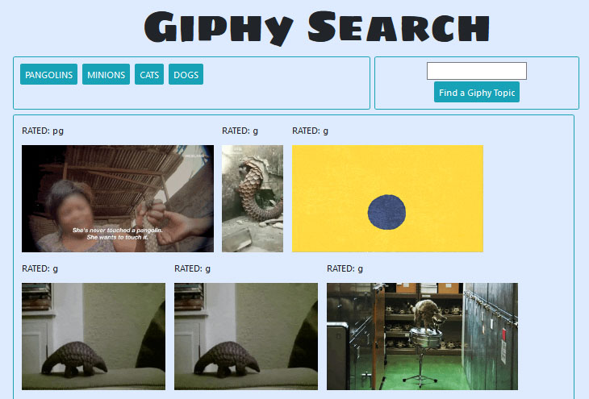

# Utilizing GIPHY API

Easily search through Giphy, for your favorite GIFs. Input your favorite GIF theme to create a button, then click the button to populate the most popular GIFs.

## Creation

Giphy.com is a website that has stored thousands and animated GIFs and MEMEs, and non-animated GIFs (known as stickies). GiphyAPI utilizes giphy.com API database.

## How to run GiphyAPI

- 4 popular theme buttons have been made for you.
- Put in your own favorite theme, and another easy button will be created.
- Click on the button to be shown Giphys most popular animated GIFS.

## SCREENSHOTS

[GiphyAPI built by EpikNohVuh](https://EpikNohVuh.github.io/GiphyAPI/)

## Built With

- jQUERY
- Google Fonts
- BootstrapCDN
- JavaScript to make the page dynamic
- HTML & local CSS
- AJAX for API GET requests

#### Sole Collaborator for GiphyAPI